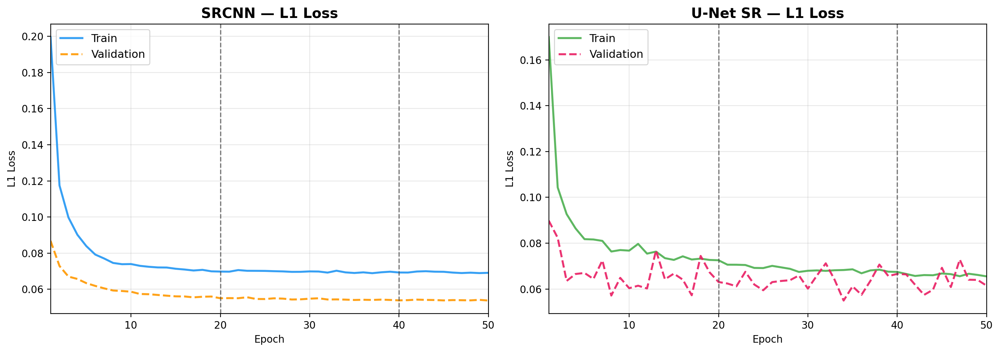
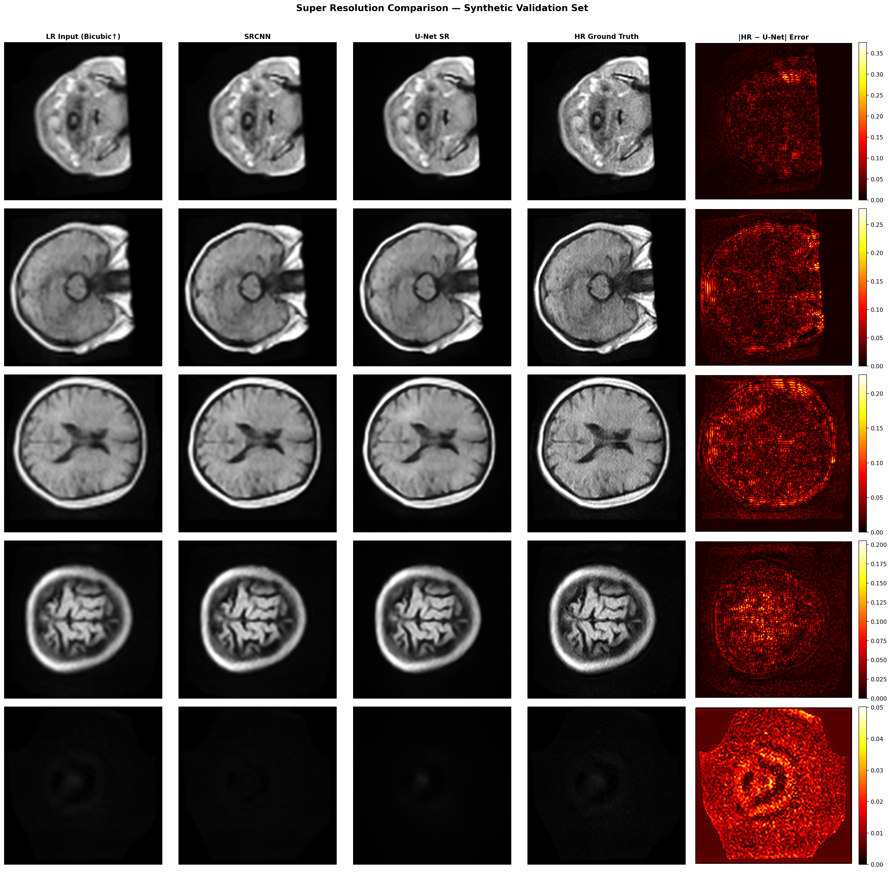
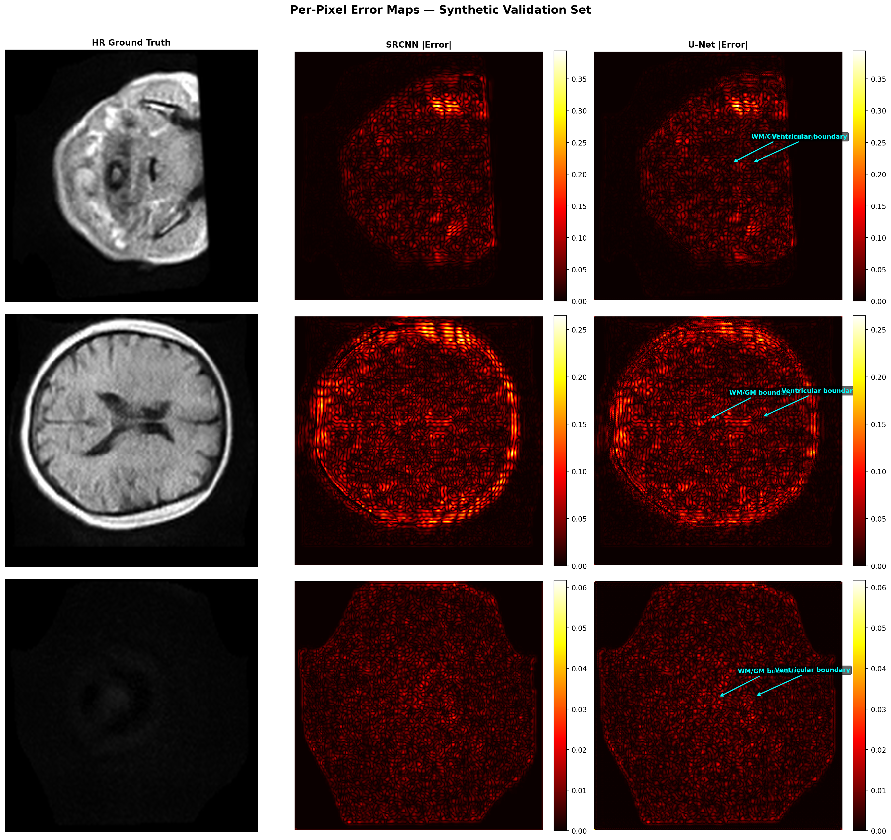

<p align="center">
  
  
  
  
</p>

# MRI Super Resolution: Enhancing Low-Field Brain MRI with Deep Learning

> **Single-image super-resolution of 64 mT brain MRI scans using SRCNN and U-Net architectures, trained on synthetically degraded image pairs with a 4x upsampling factor.**

---

## Table of Contents

- [Overview](#overview)
- [Dataset](#dataset)
- [Architecture](#architecture)
- [Pipeline](#pipeline)
- [Results](#results)
- [Visual Outputs](#visual-outputs)
- [Project Structure](#project-structure)
- [Getting Started](#getting-started)
- [Configuration](#configuration)
- [Acknowledgements](#acknowledgements)

---

## Overview

Low-field MRI scanners (e.g. 64 mT) are portable and affordable, making brain imaging accessible in resource-limited settings. However, their spatial resolution is inherently lower than clinical 3T scanners. This project addresses that gap by training deep learning models to **super-resolve low-field brain MRI** slices by a factor of **4x**, recovering fine anatomical detail lost during acquisition.

Two models are implemented and compared against a bicubic interpolation baseline:

| Model | Description | Parameters |
|-------|-------------|------------|
| **Bicubic** | Non-learnable baseline using cubic spline interpolation | 0 |
| **SRCNN** | 3-layer CNN (Dong et al. 2014, adapted for MRI) | ~34 K |
| **U-Net SR** | 4-stage encoder-decoder with skip connections | ~31 M |

Both learned models are trained with **L1 (MAE) loss**, **Adam optimizer**, and **StepLR scheduling** on synthetically degraded 64 mT brain slices (bicubic downsample 4x then upsample back), ensuring domain-consistent supervision.

---

## Dataset

This project uses the **"Paired 64 mT and 3T Brain MRI Scans of Healthy Subjects"** dataset published on Zenodo by researchers at Leiden University Medical Center (LUMC).

| Property | Details |
|---|---|
| **Subjects** | Healthy volunteers scanned at both 64 mT and 3T |
| **Modality** | T1-weighted (T1w) |
| **Format** | NIfTI (`.nii.gz`), BIDS-compliant directory layout |
| **Training** | 64 mT volumes from unpaired subjects — synthetic LR/HR generation via bicubic 4x degradation |
| **Testing** | 10 paired subjects with both 64 mT and 3T-highres scans for cross-scanner evaluation |
| **Preprocessing** | 99th percentile clipping, min-max normalization to [0, 1], 10% outer-slice trimming |
| **Slice Size** | 256 x 256 pixels (resampled) |
| **Train Patches** | 64 x 64 random crops with horizontal flipping augmentation |

### Data Split Strategy

```
64 mT Volumes (unpaired subjects)
├── 80% ─── Training set (synthetic LR/HR pairs)
└── 20% ─── Validation set (synthetic LR/HR pairs)

Paired Subjects (10 subjects with both 64mT & 3T)
└── 100% ── Test set (cross-scanner evaluation)
```

> Splitting is done at the **subject level** (not slice level) to prevent data leakage between train and validation sets.

---

## Architecture

### SRCNN

A lightweight 3-layer convolutional network that operates on the **pre-upsampled** (bicubic) input:

```
Input (1, 256, 256)
  │
  ├── Conv2d(1 → 64, 9×9) + ReLU        ← Feature extraction
  ├── Conv2d(64 → 32, 1×1) + ReLU       ← Non-linear mapping
  └── Conv2d(32 → 1, 5×5)               ← Reconstruction
  │
Output (1, 256, 256)
```

### U-Net SR

A 4-stage encoder-decoder with skip connections and transposed convolutions for upsampling:

```
Input (1, 256, 256)
  │
  ├── Encoder 1: ConvBlock(1 → 64)       ──────────────────┐
  ├── MaxPool → Encoder 2: ConvBlock(64 → 128)    ────────┐│
  ├── MaxPool → Encoder 3: ConvBlock(128 → 256)   ───────┐││
  ├── MaxPool → Encoder 4: ConvBlock(256 → 512)   ──────┐│││
  ├── MaxPool → Bottleneck: ConvBlock(512 → 1024)       ││││
  ├── TransConv + Skip ← Decoder 4: ConvBlock(1024 → 512)┘│││
  ├── TransConv + Skip ← Decoder 3: ConvBlock(512 → 256) ─┘││
  ├── TransConv + Skip ← Decoder 2: ConvBlock(256 → 128) ──┘│
  ├── TransConv + Skip ← Decoder 1: ConvBlock(128 → 64)  ───┘
  └── Conv2d(64 → 1, 1×1)
  │
Output (1, 256, 256)
```

Each `ConvBlock` consists of: `Conv2d(3×3) → BatchNorm → ReLU → Conv2d(3×3) → BatchNorm → ReLU`

### Bonus Components

| Component | Description |
|---|---|
| **Perceptual Loss** | VGG-19 feature loss (up to `relu2_2`) for texture-aware training |
| **Rician Noise** | Physics-based MRI noise injection: `sqrt((x + n₁)² + n₂²)` for domain-realistic augmentation |

---

## Pipeline

The entire workflow is orchestrated by `main.py` in five sequential phases:

```
Phase 1 ─ Data Preparation
    Load NIfTI volumes, extract 2D axial slices, generate synthetic LR/HR pairs
    Split into train / validation / test DataLoaders
                │
Phase 2 ─ Train SRCNN
    50 epochs, L1 loss, Adam (lr=1e-4), StepLR (step=20, γ=0.5)
    Best checkpoint saved by validation loss
                │
Phase 3 ─ Train U-Net SR
    Same training protocol as SRCNN
                │
Phase 4 ─ Evaluate All Methods
    Synthetic evaluation (val set) + Cross-scanner evaluation (test set)
    Compute PSNR and SSIM for Bicubic / SRCNN / U-Net
                │
Phase 5 ─ Generate Visualizations
    Loss curves, comparison grids, per-pixel error maps
```

---

## Results

### Synthetic Evaluation (Primary)

Evaluated on the held-out validation set using synthetic LR/HR pairs from the same 64 mT domain. This is the primary metric since the LR and HR images are perfectly aligned.

| Method | PSNR (dB) | SSIM | Slices |
|--------|-----------|------|--------|
| Bicubic | 31.52 ± 7.28 | 0.8944 ± 0.0546 | 416 |
| SRCNN | 33.86 ± 6.31 | 0.9218 ± 0.0395 | 416 |
| **U-Net SR** | **34.32 ± 5.90** | **0.9264 ± 0.0359** | **416** |

**Key Takeaways:**
- U-Net SR achieves the best performance with **+2.80 dB PSNR** and **+0.032 SSIM** over the bicubic baseline
- SRCNN provides a strong improvement (**+2.34 dB**) with only ~34K parameters
- Both models demonstrate consistent improvements with lower standard deviations than bicubic

### Cross-Scanner Evaluation (Reference)

Evaluated on real paired 64 mT → 3T test subjects. Low scores are expected due to inherent contrast, geometry, and resolution differences between the two scanners (no spatial registration applied).

| Method | PSNR (dB) | SSIM | Slices |
|--------|-----------|------|--------|
| Bicubic | 10.01 ± 1.32 | 0.2237 ± 0.0777 | 320 |
| SRCNN | 9.83 ± 1.28 | 0.2243 ± 0.0781 | 320 |
| U-Net SR | 9.86 ± 1.28 | 0.2270 ± 0.0785 | 320 |

> These scores reflect the **domain gap** between 64 mT and 3T, not model failure. Cross-scanner super-resolution would require domain adaptation or paired training strategies.

---

## Visual Outputs

### Training Loss Curves

Training and validation L1 loss across 50 epochs for both models. Both models converge smoothly with the StepLR schedule reducing the learning rate at epoch 20 and 40.

<p align="center">
  
</p>

### Super-Resolution Comparison Grid

Side-by-side comparison of LR input, SRCNN output, U-Net output, HR ground truth, and per-pixel error maps across 5 representative slices from the validation set:

<p align="center">
  
</p>

### Per-Pixel Error Maps

Detailed error analysis showing absolute difference heatmaps with anatomically annotated high-error regions. The U-Net consistently produces lower error, particularly at white matter / grey matter boundaries:

<p align="center">
  
</p>

---

## Project Structure

```
mriEnhancement/
│
├── config.py              # Central configuration (paths, hyperparameters, constants)
├── dataset.py             # BIDS scanning, NIfTI loading, slice extraction, DataLoaders
├── models.py              # SRCNN, U-Net SR, Perceptual Loss, Rician noise
├── train.py               # Training loop with L1 loss, Adam, StepLR, checkpointing
├── evaluate.py            # PSNR/SSIM evaluation (synthetic + cross-scanner)
├── visualize.py           # Loss curves, comparison grids, error heatmaps
├── main.py                # Master orchestrator — runs the full 5-phase pipeline
│
├── data_exploration.ipynb # Jupyter notebook for exploratory data analysis
├── requirements.txt       # Python dependencies
├── .gitignore
│
├── outputs/
│   ├── checkpoints/
│   │   ├── srcnn_mri.pth          # Trained SRCNN weights
│   │   ├── srcnn_mri_log.json     # SRCNN epoch-level loss history
│   │   ├── unet_sr_mri.pth        # Trained U-Net SR weights
│   │   └── unet_sr_mri_log.json   # U-Net epoch-level loss history
│   ├── figures/
│   │   ├── loss_curves.png
│   │   ├── comparison_grid.png
│   │   └── error_maps.png
│   ├── evaluation_results.json        # Synthetic eval metrics
│   └── evaluation_cross_scanner.json  # Cross-scanner eval metrics
│
└── MRIData/               # Raw BIDS dataset (not tracked in git)
    └── Data/
        ├── 3T data/       # High-resolution 3T scans
        └── 64mT data/     # Low-field 64mT scans
```

---

## Getting Started

### Prerequisites

- Python 3.10+
- A CUDA-capable GPU, Apple Silicon (MPS), or CPU

### Installation

```bash
# Clone the repository
git clone https://github.com/your-username/mriEnhancement.git
cd mriEnhancement

# Create a virtual environment
python -m venv .venv
source .venv/bin/activate   # macOS / Linux
# .venv\Scripts\activate    # Windows

# Install dependencies
pip install -r requirements.txt
```

### Data Setup

1. Download the **"Paired 64 mT and 3T Brain MRI Scans of Healthy Subjects"** dataset from [Zenodo](https://zenodo.org/)
2. Place the extracted data under the project root so the structure matches:
   ```
   mriEnhancement/
   └── Paired 64mT and 3T Brain MRI Scans …/
       └── Data/
           ├── 3T data/
           └── 64mT data/
   ```
3. Or update `DATA_ROOT` in `config.py` to point to your data location.

### Run the Full Pipeline

```bash
python main.py
```

This will sequentially: load data, train SRCNN (50 epochs), train U-Net (50 epochs), evaluate all methods, and generate visualizations. All outputs are saved to the `outputs/` directory.

### Run Individual Components

```bash
# Train models only
python train.py

# Evaluate pre-trained models
python evaluate.py

# Generate visualizations from existing checkpoints
python visualize.py
```

---

## Configuration

All hyperparameters are centralized in [`config.py`](config.py):

| Parameter | Value | Description |
|-----------|-------|-------------|
| `SEED` | 42 | Random seed for reproducibility |
| `IMAGE_SIZE` | 256 | Target 2D slice resolution |
| `SCALE_FACTOR` | 4 | Bicubic downsampling factor for synthetic LR |
| `PATCH_SIZE` | 64 | Random crop size during training |
| `VAlL_RATIO` | 0.20 | Fraction of training subjects held out for validation |
| `LEARNING_RATE` | 1e-4 | Adam optimizer learning rate |
| `BATCH_SIZE` | 16 | Training batch size |
| `NUM_EPOCHS` | 50 | Training epochs per model |
| `LR_STEP_SIZE` | 20 | StepLR decay interval |
| `LR_GAMMA` | 0.5 | StepLR decay factor |
| `SLICE_TRIM_FRAC` | 0.10 | Fraction of noisy edge slices discarded per volume |

---

## Acknowledgements

- **Dataset**: van den Broek, R., Webb, A., & Lena, B. (2025). *Paired 64 mT and 3T Brain MRI Scans of Healthy Subjects for Neuroimaging Research.* Zenodo.
- **SRCNN**: Dong, C. et al. (2014). *Learning a Deep Convolutional Network for Image Super-Resolution.* ECCV.
- **U-Net**: Ronneberger, O. et al. (2015). *U-Net: Convolutional Networks for Biomedical Image Segmentation.* MICCAI.
- **Perceptual Loss**: Johnson, J. et al. (2016). *Perceptual Losses for Real-Time Style Transfer and Super-Resolution.* ECCV.
